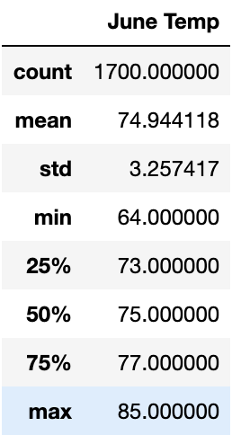
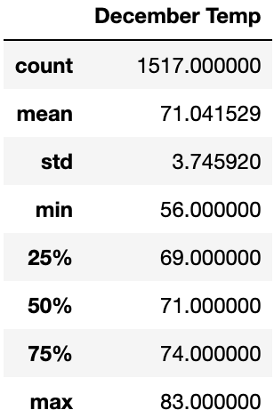

# Surf's Up!
Analyzing weather data from SQLite using SQLAlchemy in jupyter notebook and making a web app.

## **Overview**
We need to analyze the weather data for the Hawaiian island of Oahu. The purpose of doing so is to discover if it would be a viable option to open a surf and ice cream shop based on if there are favorable or unfavorable weather conditions. For this analysis, we are particularly looking at June and December.

## **Resources**
- **Software**: 
    - Jupyter Notebook
    - Python 3.7.6
    - SQLite Databases
    - SQLAlchemy
- **Data**: hawaii.sqlite

## **Results**
After analyzing our data with the describe function, we can easily compare the temperatures for June and December in Oahu.

June Data:

December Data:

Based on the above data we see that:
- The temperatures in June and December in Oahu do not vary greatly. June has a high (max) of 85F and December has a high of 83F. This implies that even at the start of the winter season there is weather that lends itself to beach-going.
- The average temperatures in June and December are 74.9F and 71F respectively. While December is cooler by nearly 4 degrees on average, both average temperatures for each month are very reasonable for beach-going weather. If we take a closer look at the quartiles, we see that each quartile is about 4 degrees cooler in December than it is in June with the standard deviation being 3.75% and 3.25% respectively.
- However, important to note is the minimum temperature in each month. In June the minimum temperature is only 64F, while in December the minimum is much lower (by 8 degrees) at 56F. This means that for a surf and ice cream shop, December may prove to be a slower revenue month, but likely not by much.

## **Summary**
As we can see, the temperatures on Oahu do not vary greatly at all between the beginning of summer and the beginning of winter. Even with the first quartile for December being 69F (vs 73F for June), the likelihood of this being considered too cold for the beach is unlikely. Especially since with these lower temperatures, in December in particular, there could be a downward skew due to lower temperatures in the middle of the night when the surf and ice cream shop would not even be open. Overall, based on temperatures alone, I can safely recommend moving forward with the surf and ice cream shop in Oahu.

### Additional Queries
While the temperature data seems to give us the go-ahead, there are a couple more things I would like to analyze for safety:

1. **I'd Rather Be Dry on a Blustery Day (Rain & Wind Data)**: If we had the opportunity to gain access to more weather data, I would be eager to take a deeper look into the amount of rain that affects Oahu. Since the goal is to make this a surf and ice cream shop, we would want to ensure that however the shop is built (i.e. beach shack with a tin roof vs foundationally built shop) it can protect the items, sellable stock, hardware, and structural integrity of the building itself from rain damage -- if it were to ever rain an excessive amount. In a similar vein, I would like to analyze the maximum wind speeds that Oahu experiences in a given month to further ensure that we are taking into account all possible ways that the shop could sustain damage.
2. **Sunny Side Up**: As we can see, the Hawaiian Islands' climate -- particularly temperature -- is pretty much the same year-round. However, the temperature can remain the same regardless of other factors that may make the outside less appealing to spend time in. For example, like noted above, it would be useful to know about rainfall and wind speed for how to avoid damages, but it would also be useful to know these things to determine if a beachside surf and ice cream shop would be a lucrative business year-round. The average beachgoer may not want to spend time on the sand and around the water if it is raining or too windy -- or even too cloudy for that matter. Another useful query, if the data were available, would be to determine how many days of clear skies Oahu sees. If the skies are cloudy then maybe to sell ice cream (or only ice cream) would not bring in as much revenue as another type of warm-weather treat. If we can take into consideration other factors other than temperature alone, we may be able to alter our business model to ensure that even with varying environmental changes the business can bring in the most revenue.
